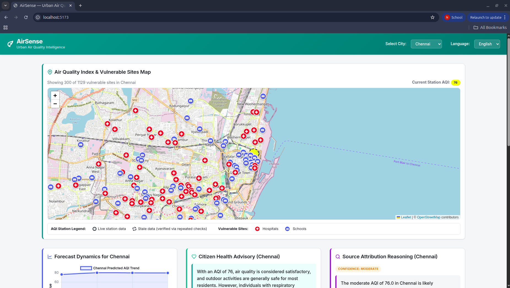
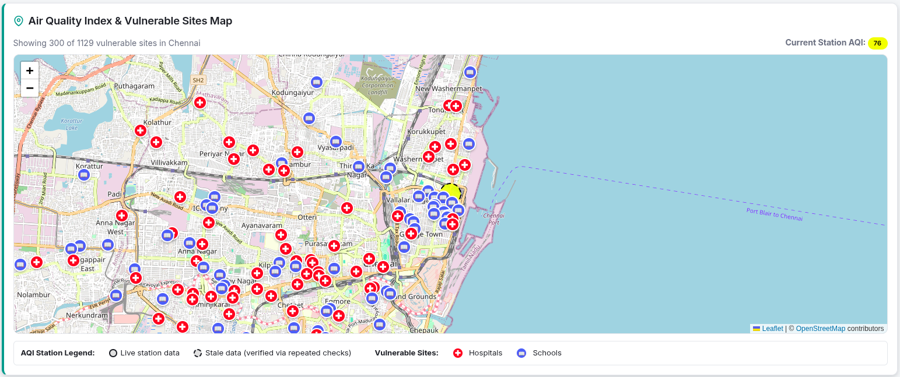
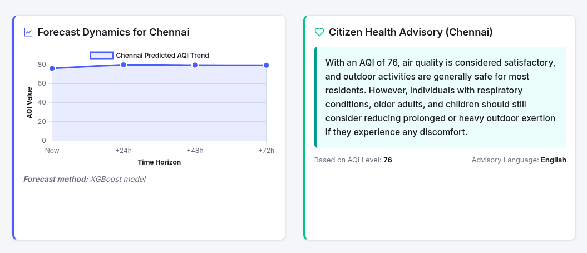

<div align="center">

# AirSense — Urban Air Quality Intelligence Platform

**A live, end-to-end air quality intelligence system that fuses real-time sensor data, weather, and geospatial data through a trained forecasting model and three purpose-built AI agents — built solo for the ET AI Hackathon 2026.**


</div>

> **The Problem**: India operates 900+ government air quality monitoring stations — yet a CAG audit found that only 31% of cities with this data have any actionable, multi-agency response protocol tied to it. The data exists. The intelligence layer that turns it into action does not.

---

## What AirSense Does

AirSense is a live dashboard for **Chennai, Delhi, and Bengaluru** that goes beyond simply displaying pollution numbers. It:

- Pulls live AQI, weather, and vulnerable-site data from three independent public sources, every hour
- Forecasts AQI 24, 48, and 72 hours ahead using a trained XGBoost model, benchmarked against a naive baseline
- Reasons about likely pollution sources using an LLM agent grounded in live wind and urban-density data
- Communicates health guidance in multiple languages via a live, multilingual LLM advisory agent
- Answers citizen questions through a grounded conversational assistant
- Prioritizes enforcement action across cities using a transparent, auditable ranking formula
- Stays honest about data quality — every stale or unavailable data point is flagged, never hidden

---


## Architecture Overview

```
┌─────────────────────────────────────────────────────────────┐
│                        DATA LAYER                            │
│   WAQI (live AQI) · OpenWeatherMap · OSM Overpass (sites)    │
│              collected hourly via cron, deduplicated         │
└───────────────────────────┬───────────────────────────────┘
                             │
┌────────────────────────────▼──────────────────────────────┐
│                     INTELLIGENCE LAYER                       │
│   XGBoost forecasting model   │   3 Gemini LLM agents        │
│   (prediction, numbers)       │   (reasoning, language)      │
└────────────────────────────┬──────────────────────────────┘
                             │
┌────────────────────────────▼──────────────────────────────┐
│                    PRESENTATION LAYER                        │
│         FastAPI REST API   →   React + Leaflet dashboard     │
└─────────────────────────────────────────────────────────────┘
```

---

## Features

| Component | Description |
|---|---|
| Live Map | Real OpenStreetMap tiles, color-coded live AQI station, distinct hospital/school markers, honest stale-data indicators |
| Forecast Panel | 24/48/72hr AQI prediction via trained XGBoost, transparently labeled with its own method (trained model vs. naive fallback) |
| Health Advisory Agent | Live, multilingual (English/Tamil/Hindi) health guidance generated by Gemini, grounded in real AQI |
| Source Attribution Agent | Reasons about likely pollution causes using live wind and site-density data, with a self-reported confidence score |
| Enforcement Priority Queue | Transparent, rule-based ranking of cities by severity, trend, and vulnerable-site density |
| Multi-City Comparison | Live side-by-side AQI comparison across all monitored cities |
| Citizen Chat Assistant | Free-text Q&A grounded in live AQI and forecast data, with off-topic redirection |

---

## Why This Tech Stack

| Choice | Reasoning |
|---|---|
| WAQI over OpenAQ | Empirically verified — OpenAQ's Indian station data was years stale; WAQI mirrors India's CPCB network in near-real time |
| XGBoost, not deep learning | Right-sized for a small tabular dataset — fast to train, easy to validate, no unnecessary complexity |
| Gemini (free tier) | Genuinely free, generous daily quota, no credit card — sustainable for a solo, self-funded build |
| Three separate LLM agents | Each agent has one job (communication, reasoning, or conversation) — keeps prompts focused and outputs predictable |
| Rule-based enforcement ranking | Ranking needs to be fast, deterministic, and auditable — not every AI feature benefits from an LLM |
| SQLite | Zero setup, file-based, entirely sufficient at this scale |
| Cron over an in-process scheduler | Survives laptop reboots, unlike a Python scheduler running inside a terminal session |

---

## Model Performance

```
Feature selection: hour_of_day, day_of_week, is_weekend, aqi_rolling_mean_6h
Model MAE:     40.576
Baseline MAE:  128.020
Improvement over naive persistence baseline:  68.3%
```

The forecasting model automatically falls back to a transparent naive method when insufficient historical data exists for a city, and upgrades to the trained model with zero code changes once enough data accumulates.

---

## Screenshots

<!--
Replace each line below with an actual image reference once you have your
screenshots saved. See "Adding Screenshots" further down for exact steps.
-->

| Dashboard Overview | Live Map with Vulnerable Sites |
|---|---|
|  |  |

| Forecast and Advisory Panels | Enforcement Priority Queue |
|---|---|
|  |  |

---

##  Live Demo

Watch the complete project demonstration here:

**▶ Demo Video:**
https://drive.google.com/file/d/1zd4P8jZPhz89xsdaK0PtmfvYuBGUpFIi/view?usp=drive_link


## Project Structure

```
airsense/
├── PROJECT_SPEC.md            Locked architecture and scope reference
├── backend/
│   ├── main.py                 FastAPI entrypoint
│   ├── config.py                API keys, city coordinates
│   ├── database.py              SQLite schema and connection
│   ├── data_ingestion/
│   │   ├── fetch_aqi.py          Live AQI (WAQI), stale-station detection
│   │   ├── fetch_weather.py      Live weather (OpenWeatherMap)
│   │   └── fetch_vulnerable_sites.py  Hospitals and schools (OSM Overpass)
│   ├── ml/
│   │   ├── features.py           Feature engineering pipeline
│   │   ├── train_model.py        XGBoost training and baseline comparison
│   │   └── predict.py            Live prediction with graceful fallback
│   ├── llm/
│   │   ├── advisory.py           Multilingual health advisory agent
│   │   ├── attribution.py        Source attribution reasoning agent
│   │   └── chat.py               Citizen chat agent
│   └── api/routes.py            All REST endpoints
└── frontend/
    └── src/
        ├── api.js                Backend API client
        ├── App.jsx               Shared state, layout
        └── components/           Seven dashboard panels
```

---

## Quick Start

### Backend

```bash
cd backend
python3.11 -m venv venv
source venv/bin/activate
pip install -r requirements.txt

# Add your API keys to a .env file:
# WAQI_API_TOKEN=...
# OPENWEATHER_API_KEY=...
# GEMINI_API_KEY=...

python database.py          # Initialize the database
python main.py               # Start the API server (localhost:8000)
```

### Frontend

```bash
cd frontend
npm install
npm run dev                  # Start the dashboard (localhost:5173)
```

### Data Collection (cron, survives reboots)

```bash
crontab -e
# Add:
0 * * * * cd /path/to/airsense/backend && venv/bin/python data_ingestion/fetch_aqi.py >> cron_aqi.log 2>&1
5 * * * * cd /path/to/airsense/backend && venv/bin/python data_ingestion/fetch_weather.py >> cron_weather.log 2>&1
```

### Train the Forecasting Model (once sufficient history has accumulated)

```bash
cd backend
python -m ml.train_model
```

---

## API Endpoints

| Endpoint | Description |
|---|---|
| `GET /api/aqi/current?city=` | Latest live AQI reading, with staleness flag |
| `GET /api/aqi/forecast?city=&horizon_hours=` | 24/48/72hr AQI forecast |
| `GET /api/weather/current?city=` | Latest weather reading |
| `GET /api/vulnerable-sites?city=` | Hospitals and schools near the monitoring station |
| `GET /api/advisory?city=&language=` | Live multilingual health advisory |
| `GET /api/attribution?city=` | Source attribution reasoning with confidence score |
| `POST /api/chat` | Citizen assistant chat |

---

## Data Sources

| Source | Provides | Why Chosen |
|---|---|---|
| WAQI (aqicn.org) | Live AQI | Mirrors CPCB's Indian station network in near-real time |
| OpenWeatherMap | Temperature, wind, humidity | Free tier, reliable, the key physical driver of pollutant dispersal |
| OpenStreetMap Overpass API | Hospitals, schools | Free, no key required, real geotagged infrastructure data |
| Google Gemini | LLM reasoning and language | Genuinely free tier, no card required |

---

## Known Limitations

Stated directly rather than glossed over:

- Satellite and remote-sensing pollution attribution (Sentinel, MODIS) is intentionally out of scope. It requires specialized geospatial processing beyond a solo hackathon timeline, and is documented here as a future-phase extension rather than silently omitted.
- Source attribution uses vulnerable-site density as an urban-activity proxy, not verified traffic or industrial emissions data, which does not exist in any public, machine-readable form for these cities today. The system states this explicitly and lowers its own confidence accordingly.
- Some monitoring stations, particularly in Chennai and Bengaluru, have genuine, verified multi-week gaps in live reporting — a documented limitation of India's current air-quality monitoring infrastructure, not a defect in this system. AirSense surfaces this transparently rather than masking it.

---

## Acknowledgments

Built solo for the ET AI Hackathon 2026, Problem Statement: "AI-Powered Urban Air Quality Intelligence for Smart City Intervention."

Data sources: CPCB / WAQI, OpenWeatherMap, OpenStreetMap contributors.
Intelligence layer: XGBoost, Google Gemini.

---

<div align="center">

**Turning India's air quality data from something we measure into something we act on.**

</div>